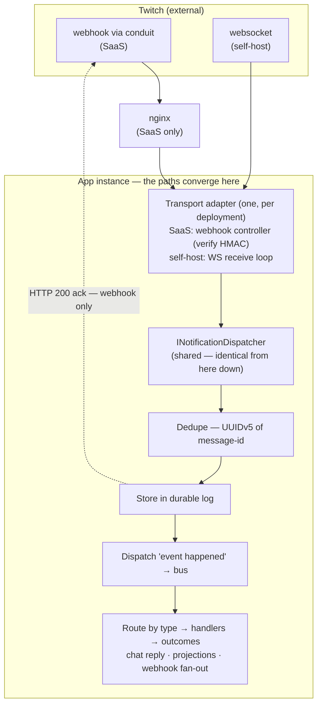
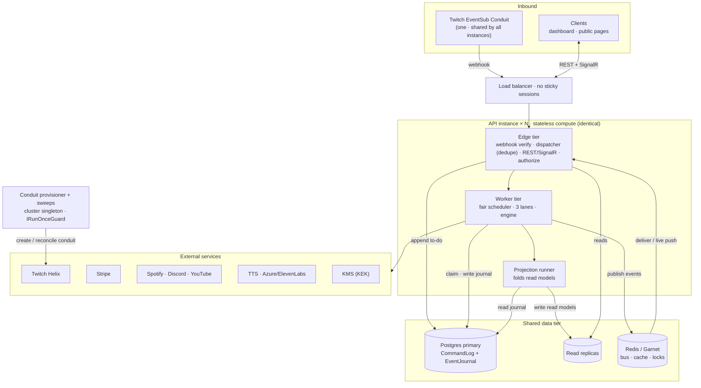
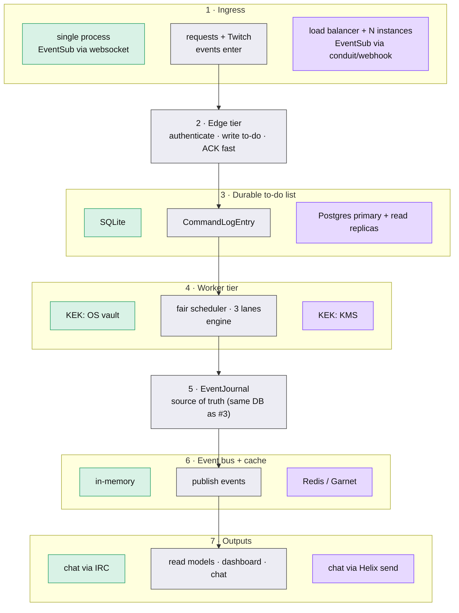
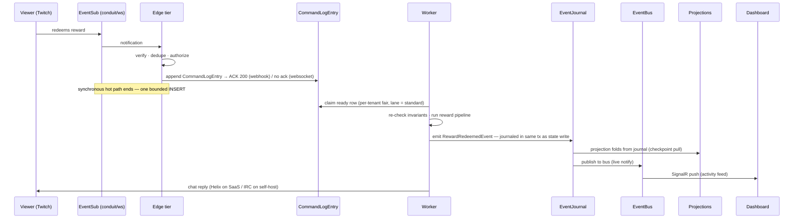

# SaaS & Self-Host Architecture — Stack + Flow

Maps the runtime. §1 is the ingress flow (two delivery paths → converge at the app instance → shared path);
§2 is the full SaaS entity topology; §3 shows what swaps for self-host; §4 is the flow zoomed in. Derived from
`spec/scaling-qos.md`, `spec/event-store.md`, `spec/twitch-eventsub.md`, `2026-06-16-deployment-profile.md`.

## 1. Ingress → converge at the app instance → shared path

The two deployments differ **only in how the event reaches an app instance** — and only the webhook path is
ACKed. They **converge inside the app instance**: whichever transport adapter is active builds the same
`EventSubNotification` and calls the same `INotificationDispatcher`, and everything from the dispatcher down is
identical code. There is no separate "merge box" — the convergence **is** the app instance.

- **Only the delivery differs:** SaaS = webhook (via conduit) → nginx → the transport adapter in *some*
  instance; self-host = websocket straight into the *one* instance's receive loop. The dispatcher and
  everything below it live inside the app instance — that box is the convergence.
- **ACK is webhook-only.** Twitch retries an HTTP webhook until it gets a `2xx`, so the webhook controller
  returns **200 after the durable store** (store-then-ack, so a crash can't lose it). A WebSocket has no
  per-event ack — Twitch pushes `notification` frames and the receive loop just reads them.
- **Identical from the dispatcher down (X → Y → Z):** dedupe → **store** → **dispatch** 'it happened' on the
  bus → **route by type** to subscribers → **outcomes**. One event, fanned to every interested handler, none
  aware of the others.

## 2. Full SaaS topology — every entity, organized in four zones

Four zones, top to bottom: **Inbound → Load balancer → API instance (×N) → Shared tiers (data + external).**
The instances are **stateless compute** — every durable thing they share (the one Twitch conduit, Postgres,
Redis) lives in the shared zones, *not* inside any instance. That's why N servers run side by side: nginx
spreads requests across identical instances, and they all read/write the same shared tier and the same
conduit. Exactly one instance at a time *manages* the conduit (the provisioner singleton).

## 3. What swaps for self-host (color-coded)

🟩 green = self-host only · 🟪 purple = SaaS only · ⬜ grey = shared core (same code both ways). The whole
compute path is identical; only the things below the spine differ. Self-host collapses the instance ×N into a
single process.

## 4. The flow, zoomed in (a redemption end to end)

## 5. The three load-bearing properties

1. **Stateless, identical instances** — any instance serves any tenant; unique state is in Postgres/Redis,
   not in-process. This is what makes rolling deploys safe, conduit EventSub survive instance churn, and N
   servers share one conduit. (Self-host is the degenerate case: exactly one instance.)
2. **Hot path = one bounded append** — the edge writes a `CommandLogEntry` and ACKs; all real work is async on
   the worker tier, fair-scheduled per tenant across 3 lanes (critical chat/mod never shed, background first).
3. **`EventJournal` is the source of truth** — events are journaled in the *same transaction* as the state
   write; projections are pull/checkpoint (rebuildable); the bus is just live-notify. A bus outage loses
   nothing.
